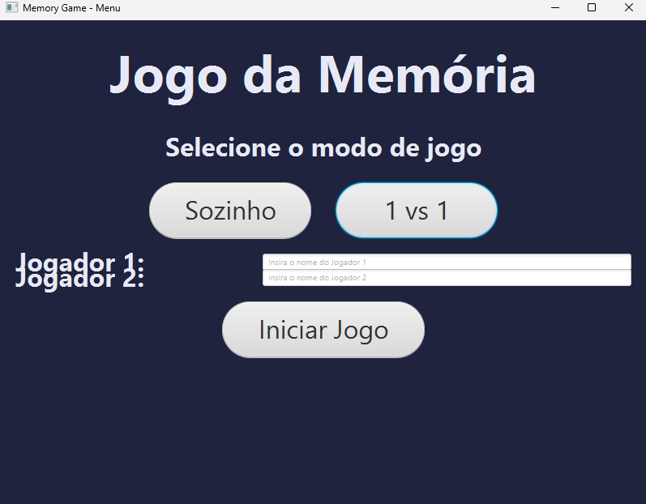
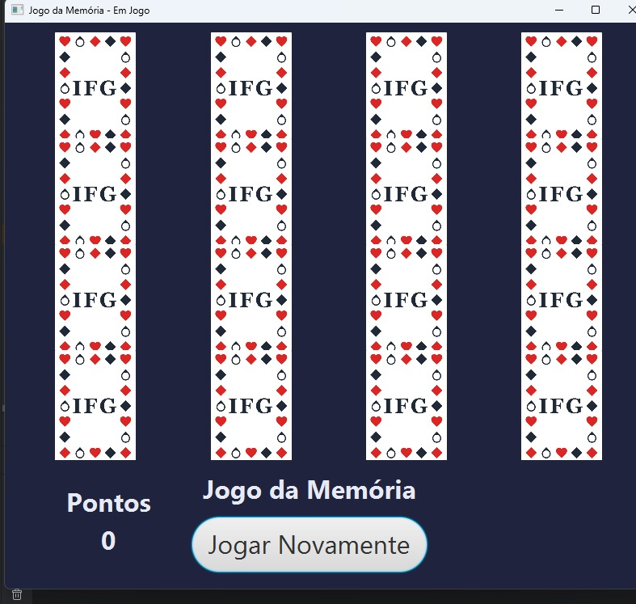
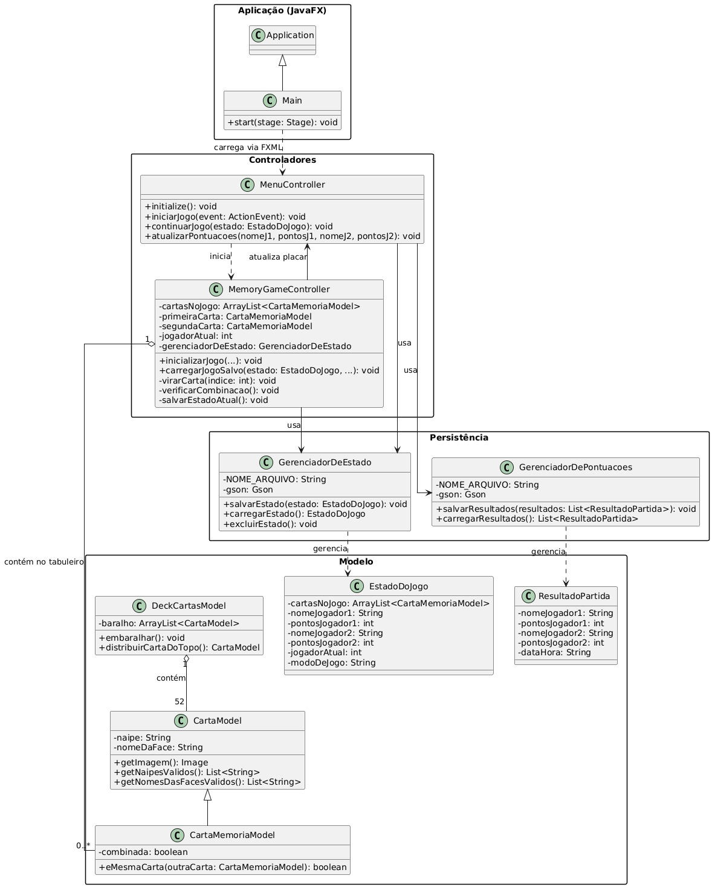

🧠 Jogo da Memória em JavaFX
Bem-vindo ao projeto Jogo da Memória, uma aplicação desktop clássica desenvolvida com Java e JavaFX. O jogo proporciona uma experiência divertida com uma interface gráfica limpa e recursos modernos, como salvamento automático e histórico de pontuações.

GitHub dos desenvolvedores: GabrielVitorSZz e yDaviDEAD1

🎮 Visão Geral
Este projeto foi criado como uma prática de aplicação dos conceitos de JavaFX, explorando arquitetura MVC, manipulação de arquivos JSON, troca de cenas com FXML, entre outros tópicos.

O jogo oferece:

Modos: Sozinho ou 1 vs 1.
Salvamento automático do estado do jogo.
Histórico de partidas com placar e nomes dos jogadores.
Interface gráfica moderna e responsiva.

🖼️ Telas do Jogo
#### Menu Principal

Permite selecionar o modo de jogo e inserir os nomes dos jogadores.

#### Tela de Jogo

Apresenta um tabuleiro 4x4 de cartas viradas. Os jogadores clicam para revelar pares e acumulam pontos.

#### Diagrama de Classe

Exibe a arquitetura MVC do projeto, separando controladores, modelo e persistência.

✨ Funcionalidades
🧍‍♂️ Modo Solo: Pratique sua memória sozinho.
🧑‍🤝‍🧑 Modo 1 vs 1: Competição entre dois jogadores com pontuação.
💾 Salvamento Automático: O estado do jogo é salvo automaticamente ao sair.
📈 Histórico de Pontuações: Resultados de partidas 1x1 são gravados e exibidos.
📝 Nomes Personalizáveis: Os jogadores podem inserir seus nomes.
🎨 Interface Moderna: Construída com FXML e estilizada com CSS.

🛠️ Tecnologias Utilizadas
Java 11+
JavaFX 17+
FXML
Gson 2.8+ (para serialização de dados JSON)
CSS (para estilização da UI)

🚀 Como Executar o Projeto
